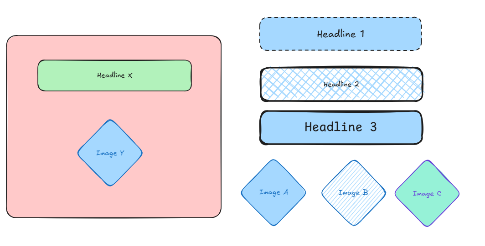
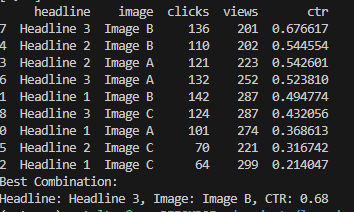
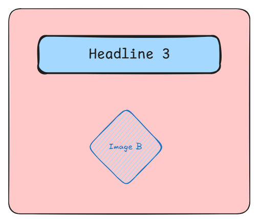

# Multivariate Testing (MVT) in Python

## Set Up Environment

```
git clone <repository-url>
cd python-mvt-testing
python3 -m venv mvt_env
source mvt_env/bin/activate
python main.py
```

## Testing MVT
1. Headline X (X = 1, 2, 3)
2. Image Y (Y = A, B, C)
3. Randomize combination of X and Y
4. Collect data on usage for these combinations
5. Analyze data using Click-Through Rate (CTR)
6. Use CTR to determine the best combination of X and Y
7. Implement the best combination in the final product

## Example
### Experiment

### Data Collection and Analysis

### Results
